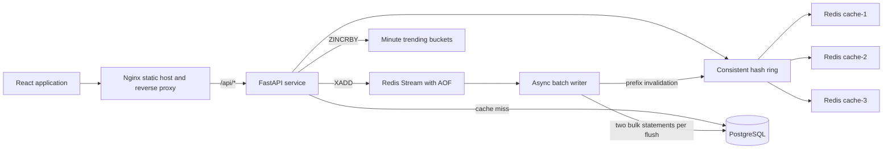
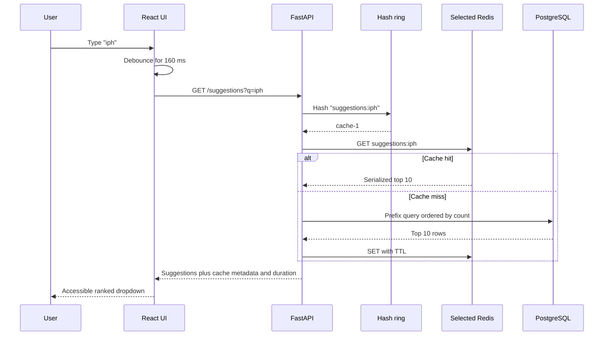
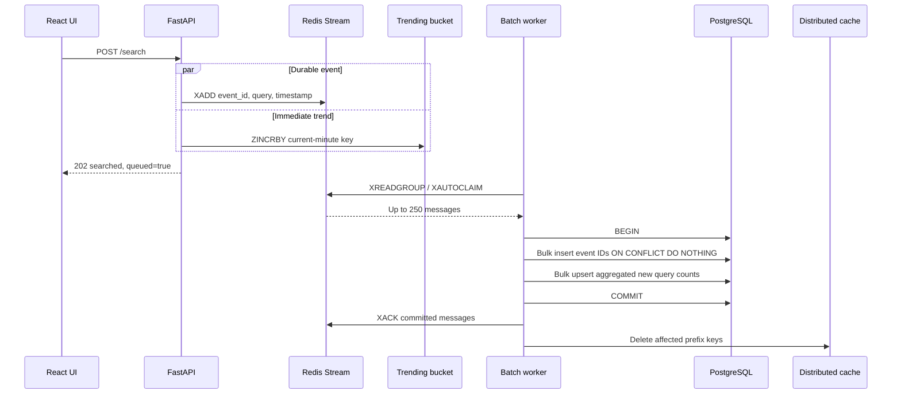
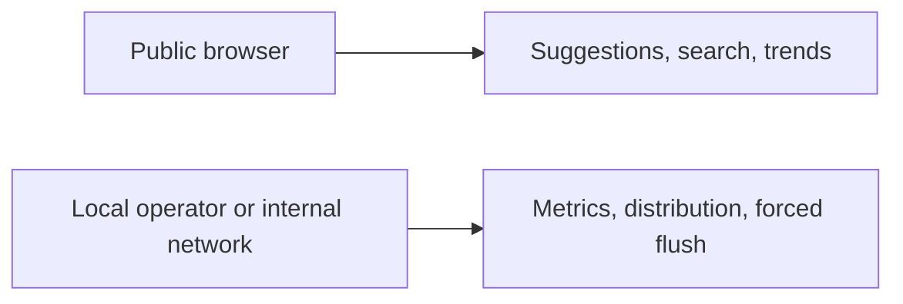
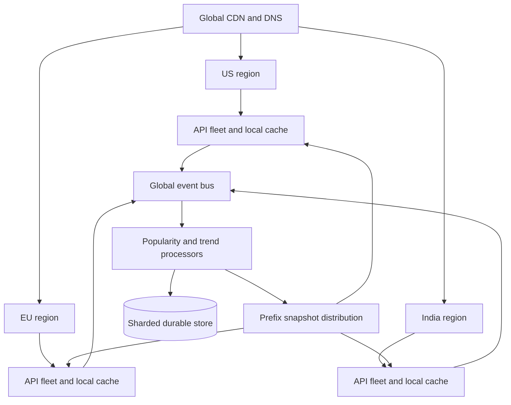

# Project Overview

## What was built

**Suggest** is a complete search typeahead application similar to the suggestion feature in Google, Amazon, YouTube, or an app marketplace. As a user types a prefix, the system returns up to ten matching queries sorted by popularity. Submitting a search immediately returns a dummy `searched` response, records the query as a live trend, and queues its popularity increment for an asynchronous batch write.

This is deliberately more than a CRUD application. The project demonstrates the backend data-system problems that matter in a high-level design discussion:

- How to search 100,000 query records quickly.
- How to make repeated reads inexpensive through caching.
- How to distribute cached keys without a central coordinator.
- How to remain available when one cache node is down.
- How to avoid one database write for every user search.
- How to preserve queued writes across crashes and retries.
- How to compute trending queries over a sliding time window.
- How to measure p95 latency, cache hit rate, database traffic, and write reduction.
- How to expose all of this through a polished and accessible interface.

## Assignment coverage

| Requirement | Implementation |
|---|---|
| Show ten suggestions sorted by search count | `GET /api/v1/suggestions`, ordered by `count DESC, query ASC`, limit 10 |
| UI for searching and suggestions | Responsive React combobox with keyboard, loading, error, and empty states |
| Dummy search API returning `searched` | `POST /api/v1/search`, HTTP 202 with `status: searched` |
| Update query-count data store | Durable stream event followed by an idempotent PostgreSQL batch upsert |
| Low-latency caching | Prefix result cache with configurable TTL |
| Distributed cache using consistent hashing | SHA-256 ring across three independent Redis nodes, 128 virtual nodes each |
| Trending searches | One-minute Redis sorted-set buckets with recency decay |
| Batch writes | Redis Stream, aggregation, configurable batch size and flush interval |
| Dataset of at least 100,000 queries | Committed reproducible CSV with exactly 100,000 unique rows |
| Report performance | Live metrics API and `PERFORMANCE_REPORT.md` |
| Easy local setup | One `docker compose up --build -d` command |

## The most important idea

The system separates the **read path** from the **write path**:

- Suggestions are read-heavy and latency-sensitive, so they use a cache-aside path.
- Popularity updates are write-heavy but do not need to be reflected synchronously, so they use a durable asynchronous batch path.
- Trending data needs immediate visibility but only short-term durability, so it uses separate minute-bucket counters in Redis.

Each path uses storage suited to its own requirements instead of forcing one database to do everything.

# Why this architecture?

Search typeahead has a highly asymmetric workload. A real product may receive a suggestion request after every keystroke but only one final search submission. One user typing a ten-character query can produce ten reads and one write. Across millions of users, serving every prefix from PostgreSQL and synchronously updating every count would create avoidable contention.

The architecture therefore follows five principles:

1. **Cache the expensive, repetitive read.** Prefixes such as `i`, `ip`, and `iph` are requested repeatedly by many users.
2. **Partition cache ownership deterministically.** Every API instance can independently calculate which Redis node owns a key.
3. **Keep PostgreSQL authoritative.** Cached suggestions can expire or be rebuilt; durable counts live in PostgreSQL.
4. **Buffer writes and aggregate repetition.** Five hundred searches for one query should become one count upsert, not five hundred upserts.
5. **Make failure visible and recoverable.** Health and metrics expose degraded states, while durable events prevent silent loss.

This architecture is complex enough to demonstrate real system-design concepts but still fits on one laptop and starts with Docker Compose.

# Complete High Level Design

## Component diagram



## Suggestion read path



The cache follows the cache-aside pattern. Redis is not the source of truth. On a miss, the API reads PostgreSQL, caches the result, and returns it. A batch update invalidates every affected prefix so stale popularity ordering does not live for the full TTL.

## Search submission and batch-write path



## Exactly-once count effect

The queue provides at-least-once delivery. At-least-once is easier to operate than pretending a distributed message is delivered exactly once. The database then turns at-least-once delivery into an exactly-once **effect**:

1. Every search event receives a UUID.
2. `processed_search_events.event_id` is a primary key.
3. A batch bulk-inserts IDs with `ON CONFLICT DO NOTHING RETURNING query`.
4. Only returned, newly inserted rows are aggregated.
5. Event IDs and count increments commit in the same transaction.
6. Redis messages are acknowledged only after commit.

If a worker crashes after commit but before acknowledgement, Redis delivers the event again. The repeated ID conflicts, returns nothing, and therefore cannot increment the query twice.

## Trending path

Each search immediately increments a Redis sorted set named like `trending:<minute-number>`. The key expires after the retention period plus a safety margin. Reading a 60-minute window pipelines the last 60 buckets and combines them in memory.

The score is:

```text
score(query) = sum(bucket_count × 0.5 ^ (bucket_age / (window_minutes / 4)))
```

This exponential decay means a recent burst ranks above an equally sized old burst. If there is little live traffic, globally popular queries fill the remaining UI slots with score zero. Live events always appear before fallback entries.

## Consistent hashing

A normal modulo partitioner calculates `hash(key) % node_count`. Adding a node changes the divisor and remaps most keys. A consistent-hash ring places both keys and cache nodes in one circular hash space. A key belongs to the first node encountered clockwise.

Physical nodes are represented by 128 virtual nodes each:

```text
cache-1:vn:0 ... cache-1:vn:127
cache-2:vn:0 ... cache-2:vn:127
cache-3:vn:0 ... cache-3:vn:127
```

Virtual nodes smooth the distribution. The implementation uses SHA-256, keeps sorted ring points, and uses binary search, so lookup is `O(log V)`, where `V` is the number of virtual points. Adding a fourth physical node moves approximately one quarter of keys rather than nearly all keys.

When the primary node fails, the service tries unique physical nodes clockwise. A 150 ms connection/command timeout limits degraded latency, and a five-second failure circuit prevents every request from waiting for the same dead node. The health endpoint reports `degraded` until the node recovers.

# Folder Structure Explained

```text
Suggestion_feature/
├── .github/workflows/ci.yml
├── backend/
│   ├── app/
│   │   ├── routers/
│   │   │   ├── search.py
│   │   │   └── system.py
│   │   ├── services/
│   │   │   ├── batch_writer.py
│   │   │   ├── cache.py
│   │   │   ├── consistent_hash.py
│   │   │   ├── metrics.py
│   │   │   ├── repository.py
│   │   │   └── trending.py
│   │   ├── config.py
│   │   ├── db.py
│   │   ├── main.py
│   │   ├── models.py
│   │   └── schemas.py
│   ├── data/queries.csv
│   ├── scripts/
│   │   ├── benchmark.py
│   │   ├── generate_dataset.py
│   │   └── smoke_test.py
│   ├── tests/
│   ├── Dockerfile
│   ├── pyproject.toml
│   ├── requirements.txt
│   └── uv.lock
├── frontend/
│   ├── src/
│   │   ├── lib/
│   │   ├── App.tsx
│   │   ├── api.ts
│   │   ├── main.tsx
│   │   ├── styles.css
│   │   └── types.ts
│   ├── Dockerfile
│   ├── nginx.conf
│   ├── package.json
│   └── vite.config.ts
├── docs/screenshots/
├── docker-compose.yml
├── Makefile
├── PERFORMANCE_REPORT.md
├── PROJECT_EXPLAINED.md
└── README.md
```

## Backend files

- `main.py`: composition root. It owns application lifespan, creates services, registers middleware and routers, seeds the dataset, and performs orderly shutdown.
- `config.py`: typed environment configuration through Pydantic Settings. Comma-separated Redis URLs and CORS origins are validated here.
- `db.py`: asynchronous engine/session factory, schema initialization, retrying startup, and high-speed PostgreSQL binary-copy ingestion.
- `models.py`: the two SQLAlchemy database tables and their indexes.
- `schemas.py`: API request/response contracts and query normalization.
- `routers/search.py`: suggestion, search submission, and trending endpoints.
- `routers/system.py`: metrics, health, cache mapping, and manual flush endpoints.
- `services/consistent_hash.py`: infrastructure-independent ring implementation.
- `services/cache.py`: Redis clients, cache-aside reads, writes, failover, health, and invalidation.
- `services/batch_writer.py`: Redis Stream consumer group and background flush lifecycle.
- `services/repository.py`: all PostgreSQL queries and the idempotent batch transaction.
- `services/trending.py`: bucket recording, decay aggregation, and popular fallback.
- `services/metrics.py`: bounded latency samples and operational counters.

## Frontend files

- `App.tsx`: the composed experience and local interaction state.
- `api.ts`: the only HTTP boundary used by UI code.
- `types.ts`: TypeScript mirrors of API responses.
- `styles.css`: tokens, components, responsive rules, animations, and accessibility preferences.
- `lib/format.ts`: isolated number formatting utilities.
- `nginx.conf`: production static serving, API proxying, gzip, SPA fallback, and security headers.

This structure avoids both extremes: one giant file and excessive micro-packages. Each file has one clear reason to change.

# Database Design

## `search_queries`

| Column | Type | Rules | Purpose |
|---|---|---|---|
| `query` | `TEXT` | Primary key | Display value and unique query identity |
| `normalized_query` | `TEXT` | Not null | Case-folded value used for prefix matching |
| `count` | `BIGINT` | Not null, default 0 | Durable global popularity |
| `updated_at` | Timestamp with timezone | Server default/current on update | Operational visibility |

Indexes:

- `text_pattern_ops` B-tree on `normalized_query` supports anchored prefix patterns such as `iph%`.
- B-tree on `count` helps global popular-query reads.

The SQL query is logically:

```sql
SELECT query, count
FROM search_queries
WHERE normalized_query LIKE 'iph%'
ORDER BY count DESC, query ASC
LIMIT 10;
```

`%`, `_`, and backslash are escaped in user prefixes so they remain literal characters rather than SQL `LIKE` wildcards.

## `processed_search_events`

| Column | Type | Rules | Purpose |
|---|---|---|---|
| `event_id` | UUID | Primary key | Idempotency key |
| `query` | `VARCHAR(512)` | Not null | Query associated with the event |
| `processed_at` | Timestamp with timezone | Server default | Audit and future retention cleanup |

This table is not a business event history. Its job is to remember which stream events already affected counts. In a long-lived production system, old acknowledged IDs would be removed after a retention interval longer than the maximum possible redelivery interval.

## Why the query text is the primary key

The project identifies a logical search by normalized text. Using the query itself avoids an extra lookup from ID to text during every upsert. For a much larger multilingual system, a surrogate `query_id` plus a unique normalized-text index would reduce index width and allow display variants or locale-specific records.

## Dataset ingestion

The CSV contains exactly 100,000 unique rows. Startup checks the table count; only an empty database is seeded. Python parses the CSV in a worker thread, then `asyncpg.copy_records_to_table` uses PostgreSQL's binary-copy path. This is much faster than 100,000 individual `INSERT` statements.

# API Design

## `GET /api/v1/suggestions`

Parameters:

- `q`: required, 1–200 characters.
- `limit`: optional, 1–10, default 10.

Response:

```json
{
  "query": "iph",
  "suggestions": [
    {"query": "iphone", "count": 1000000},
    {"query": "iphone 15", "count": 850000}
  ],
  "cached": true,
  "cache_node": "cache-1",
  "duration_ms": 1.57
}
```

Cache metadata is included because this is an educational system-design project. A consumer product might expose it only in debug headers.

## `POST /api/v1/search`

Request:

```json
{"query": "iphone charger"}
```

Response: HTTP 202 Accepted.

```json
{
  "status": "searched",
  "query": "iphone charger",
  "event_id": "uuid",
  "queued": true,
  "message": "Searched for \"iphone charger\". Popularity update queued."
}
```

HTTP 202 is semantically correct because the user-facing search action is accepted while the durable popularity write completes asynchronously.

## `GET /api/v1/trending`

Parameters:

- `limit`: 1–20.
- `window_minutes`: 5–1,440.

Returns ranked query, decayed score, source (`live-window` or `popular-fallback`), generation time, and window.

## Operational endpoints

- `/health`: checks PostgreSQL and every Redis node. Returns `healthy` or `degraded` while remaining HTTP 200 so orchestration does not kill a service that can still fail over.
- `/api/v1/metrics`: application counters and latency percentiles.
- `/api/v1/system/cache-distribution`: explains sample key ownership.
- `/api/v1/system/flush`: forces one flush for demonstrations and automated tests.
- `/docs`: generated OpenAPI Swagger interface.

## API consistency rules

- All product endpoints live under `/api/v1` so breaking changes can receive a new version.
- Pydantic validates and documents all public payloads.
- Query text is trimmed, case-folded, and internal whitespace is collapsed.
- Request IDs are accepted or generated and returned through `X-Request-ID`.
- `X-Response-Time-Ms` exposes per-request service timing.

# System Design Decisions

## Cache-aside instead of write-through

Suggestion results are derived data. Cache-aside keeps the database independent from cache availability: a cache failure causes a database read, not a failed business write. The cost is possible cold misses and explicit invalidation after popularity changes.

## Application-level consistent hashing

Redis Cluster already distributes keys, but using it would hide the main concept the assignment wants demonstrated. Three ordinary Redis instances make the ownership algorithm visible and testable. Every stateless API replica can build the same ring from the same ordered node list.

## Redis Stream instead of an in-memory queue

An `asyncio.Queue` would be simpler but loses unflushed searches when the process exits. Redis Stream provides:

- Persistence through AOF.
- Consumer groups.
- Pending-entry tracking.
- Explicit acknowledgement.
- Redelivery and `XAUTOCLAIM` after a worker dies.

Kafka would provide stronger large-scale streaming features but would be excessive for a laptop assignment.

## Event IDs instead of deleting-before-writing

Destructive reads such as `GETDEL pending-counts` create a dangerous choice: delete before the database write and risk loss, or delete afterward and risk duplication. A durable log plus database idempotency makes retries safe.

## One-minute trend buckets

A single all-time trending sorted set cannot answer different windows or age entries accurately. Minute buckets make time-window selection explicit and allow old data to disappear through TTL without a cleanup scan.

## TTL plus targeted invalidation

TTL guarantees eventual freshness even if invalidation fails. Targeted prefix invalidation normally updates ordering immediately after a flush. The combination is safer than relying exclusively on either mechanism.

## One FastAPI process in Compose

The development stack runs one process so in-memory metrics are internally consistent. The service itself is stateless with respect to business data, so production can run many API replicas. Production metrics would move to Prometheus rather than being aggregated inside one process.

# Technology Stack

| Layer | Technology | Role |
|---|---|---|
| Frontend | React 19 + TypeScript | Accessible, component-based search interaction |
| Build | Vite | Fast development and optimized static bundle |
| Styling | Custom CSS design system | Purpose-built premium visual language without UI-kit weight |
| Web server | Nginx | Static assets, SPA fallback, gzip, reverse proxy, headers |
| API | FastAPI | Async HTTP, validation, OpenAPI, lifespan management |
| Data validation | Pydantic | Typed environment and API contracts |
| ORM/query layer | SQLAlchemy 2 async | Models, transactions, PostgreSQL upserts |
| PostgreSQL driver | asyncpg | Async I/O and fast binary-copy ingestion |
| Primary database | PostgreSQL 16 | Durable counts and transactional idempotency |
| Cache/queue/trends | Redis 7.4 | Low-latency keys, Stream, sorted sets, TTL |
| Local orchestration | Docker Compose | Reproducible six-container topology |
| Python environment | uv | Fast dependency resolution and lock file |
| Tests | Pytest, Vitest | Backend algorithms and frontend utilities |
| Quality | Ruff, TypeScript strict mode | Static correctness and maintainability |
| CI | GitHub Actions | Backend, frontend, images, and production smoke flow |

# Why each technology was chosen

## React and TypeScript

Typeahead is interaction-heavy: debounce, cancellation, keyboard state, highlighted rows, loading, error, and submission feedback all change independently. React expresses these transitions cleanly. TypeScript catches mismatches between API shapes and UI assumptions before deployment.

## Vite

The product is a client-rendered single page. It does not need Next.js server rendering, route loaders, or server components. Vite gives a smaller operational surface and produces static files that Nginx can serve cheaply.

## FastAPI

FastAPI maps naturally to an I/O-bound API and background async worker. Pydantic validation and automatic OpenAPI are especially valuable for an assignment that must be explained in a viva.

## PostgreSQL

Counts must survive process and cache failures. PostgreSQL supplies transactional bulk upserts, unique constraints for idempotency, mature indexing, and predictable local operation. The data volume is tiny for PostgreSQL but the semantics are realistic.

## Redis

One technology provides three different data structures without confusing their responsibilities:

- String values for serialized suggestion lists.
- Stream entries for durable ordered work.
- Sorted sets for per-minute trend counts.

Redis latency and TTL behavior also match typeahead caching well.

## Nginx

Nginx serves immutable frontend assets efficiently and gives the browser one same-origin address. The UI calls `/api/v1`; Nginx forwards it to FastAPI, avoiding production CORS complexity.

## Docker Compose

The project genuinely needs multiple processes. Compose makes PostgreSQL, three Redis nodes, FastAPI, and Nginx reproducible with health-ordered startup and persistent volumes.

# Alternatives that were considered

| Alternative | Why it was not selected here | When it would be better |
|---|---|---|
| Trie entirely in API memory | Fast but duplicated per replica, expensive rebuilds, poor live-update story | Read-only embedded dictionary |
| Elasticsearch/OpenSearch completion suggester | Powerful but operationally heavy for 100k rows | Typo tolerance, analyzers, multilingual ranking at scale |
| PostgreSQL only | Simplest but repeated prefixes create unnecessary reads | Low traffic or strong simplicity requirement |
| Redis Cluster | Production-grade sharding but hides assignment-level consistent hashing | Managed large Redis deployment |
| `hash(key) % N` | Easy but remaps most keys when N changes | Fixed shard count that never changes |
| In-memory queue | Minimal code but loses events on crash | Disposable analytics events |
| RabbitMQ | Strong queues but extra system and less natural trend/cache reuse | Complex routing and work queues |
| Kafka | Excellent throughput/replay but too heavy for local assignment | Multi-consumer event platform at very high volume |
| Synchronous database increment | Immediate consistency but one write per search | Low volume and counts that must be instantly durable |
| Next.js | More capability than this static SPA needs | SEO pages or server-rendered content |
| Tailwind/UI kit | Faster commodity components but more generic visual result | Large team with established design tokens |
| WebSocket trends | Immediate push but extra connection lifecycle | Live dashboard where sub-second updates matter |

# UI/UX Design Decisions

## Visual direction

The UI takes inspiration from Linear, Vercel, and Raycast without copying a specific product. It uses:

- Near-black layered surfaces instead of flat pure black.
- A restrained green/violet/blue infrastructure palette.
- Fine grid lines and ambient gradients to imply a technical system.
- Large Manrope display type and smaller DM Sans interface type.
- Low-contrast borders, shallow translucency, and deliberate whitespace.
- Motion only for feedback and data flow, with reduced-motion support.

The result feels like a search product rather than a generic admin dashboard.

## Interaction decisions

- Suggestions wait 160 ms after typing, reducing unnecessary network requests without feeling sluggish.
- Every new request owns an `AbortController`; stale responses cannot replace newer input.
- The combobox exposes ARIA roles and active descendant state.
- Arrow Up/Down changes the active row, Enter submits it, and Escape closes the popup.
- Mouse hover and keyboard selection share the same active styling.
- Search submission closes the dropdown and displays an explicit queued confirmation.
- Trending items are buttons that put the query back into the search field.
- Metrics make hidden backend behavior visible: p95, cache hit rate, writes saved, and cache-node health.

## Responsive decisions

At tablet width, the two insight cards stack. At 560 px:

- Header status becomes compact.
- The heading scales down without losing hierarchy.
- Search-count metadata is hidden inside suggestions.
- Architecture nodes become a vertical flow.
- Footer becomes centered and stacked.

The breakpoint was browser-tested at 390 × 844.

## Accessibility

- Semantic `main`, headings, links, buttons, and articles are used.
- Search uses `role=combobox`, `aria-expanded`, `aria-controls`, and `aria-activedescendant`.
- Suggestion rows use `role=option` and `aria-selected`.
- Loading state has an accessible label.
- Submission confirmation uses a live `status` region.
- Focus behavior is keyboard-operable.
- Text and primary controls use high contrast.
- `prefers-reduced-motion` effectively disables animations.

# State Management

The application intentionally uses React local state rather than Redux, Zustand, or a server-state library. There is one page and no distant component tree requiring shared mutation.

Important states in `App.tsx`:

- `query`: controlled input value.
- `suggestions`: current ranked results.
- `suggestionMeta`: cache node, hit/miss, and timing.
- `trending`: current trend list.
- `metrics`: periodically refreshed operational state.
- `activeIndex`: keyboard-highlighted suggestion.
- `isOpen`: popup visibility.
- `isLoading`: active suggestion request.
- `error`: user-facing recoverable error.
- `result`: last accepted search response.
- `isSubmitting`: prevents duplicate submissions.

Refs hold DOM focus targets and the one-shot suppression flag that prevents a successful submission from immediately reopening suggestions when the selected text changes.

Data fetching rules:

- Suggestions are event-driven, debounced, and cancellable.
- Trending loads on mount and after a submission.
- Metrics poll every four seconds.
- Supplementary metric/trend failures do not disable primary search.

If the application gained multiple pages, offline support, mutations, and shared filters, TanStack Query plus a small UI store would become worthwhile.

# Authentication Flow

There is intentionally **no end-user authentication**. Searching and reading suggestions are public product actions, and the assignment does not define accounts, private data, or personalized results.

Current trust model:



For an internet deployment, operational endpoints should not remain public. The production flow would be:

1. User authenticates with an identity provider using OAuth 2.0/OIDC if personalized search history is required.
2. The browser receives a short-lived secure session cookie, not a token in local storage.
3. A gateway validates the session and forwards user identity.
4. Public suggestion/search endpoints may allow anonymous traffic with rate limits.
5. `/metrics`, cache mapping, and manual flush require a service/admin role and live on a private network.
6. Redis and PostgreSQL accept connections only from application subnets using separate rotated credentials.

The lack of authentication is a scoped product decision, not an accidental omission.

# Data Flow

## From dataset to suggestion

1. Compose waits for PostgreSQL and all three Redis nodes.
2. FastAPI creates tables.
3. If `search_queries` is empty, it reads the CSV and binary-copies 100,000 records.
4. User types a normalized prefix.
5. API calculates its cache node.
6. A hit returns immediately; a miss queries PostgreSQL and fills Redis.
7. UI renders results and cache timing.

## From search to durable count

1. UI posts normalized search text.
2. API creates an event UUID.
3. It appends to the Redis Stream and increments the current trend bucket concurrently.
4. API returns 202.
5. Worker reads/claims a batch.
6. PostgreSQL atomically records new IDs and increments aggregated query rows.
7. Worker acknowledges messages.
8. Affected cached prefixes are deleted.
9. The next suggestion request sees updated ordering from PostgreSQL.

## From search to trend

1. Search increments the current one-minute sorted set.
2. Trend reads pipeline all bucket keys in the selected window.
3. Counts are multiplied by age-based decay.
4. Scores are sorted descending.
5. Popular queries fill unused slots.

# Error Handling

## API boundary

- Pydantic turns malformed or invalid inputs into structured 422 responses.
- Query length and result limits have explicit bounds.
- Unexpected errors are logged with request ID and return a generic 500 body without a stack trace.
- Request IDs are returned so a client report can be correlated with server logs.

## Database startup

Database schema connection retries up to 20 times with bounded backoff. Compose health dependencies normally prevent early connection, while application retry protects other deployment environments.

## Cache failure

- Each operation has a 150 ms socket/connect timeout.
- The ring tries the next physical node clockwise.
- Failed nodes enter a five-second local failure circuit.
- A total cache failure still allows a database read; cache fill may be skipped.
- Health exposes `degraded` and metrics count failovers.

## Batch failure

- The worker catches failures without acknowledging events.
- The database transaction rolls back as one unit.
- Redis retains pending work.
- On restart, `XAUTOCLAIM` recovers idle entries.
- Idempotency makes retry safe.

## Frontend failure

- An aborted stale request is silent.
- Suggestion failures display a recovery message and still allow Enter submission.
- Trend and metric failures do not block search.
- Disabled state prevents blank or duplicate submission.

# Security Considerations

## Implemented controls

- Parameterized SQLAlchemy statements prevent SQL injection.
- `%`, `_`, and backslash are escaped in prefix patterns.
- Pydantic enforces types, lengths, and numeric limits.
- Search text is normalized before storage and lookup.
- The application never renders user text as HTML, so React escapes it by default.
- CORS allows only configured development origins.
- Nginx adds `X-Content-Type-Options`, `X-Frame-Options`, and a strict referrer policy.
- Containers run the Python service as an unprivileged `app` user.
- Database and Redis credentials are environment-driven; `.env` is ignored.
- No personal data is present in the generated dataset.
- Error responses do not expose internal tracebacks.
- Dependency lock files make builds reproducible and auditable.

## Controls required before a public production launch

- Put an API gateway/WAF in front of the service.
- Add per-IP and per-account token-bucket rate limits.
- Protect operational endpoints with mTLS or admin identity.
- Use TLS everywhere, including managed database/cache connections.
- Store secrets in a cloud secret manager and rotate them.
- Configure a restrictive Content Security Policy.
- Add request-body size limits at Nginx/gateway.
- Add abuse controls against trend manipulation and bot-generated searches.
- Remove or heavily restrict manual batch flush.
- Segment Redis and PostgreSQL onto private networks.
- Run dependency, image, and secret scans in CI.
- Define data retention and privacy rules if user identity or history is added.

# Scalability Considerations

## Current limits

- PostgreSQL executes prefix matching directly over 100,000 rows.
- The metrics service is per process.
- One worker consumes the stream.
- Cache node membership comes from static configuration.
- Trending queries read up to 1,440 minute buckets.
- Prefix invalidation deletes every character prefix sequentially.

These choices are appropriate for the assignment scale and make the important logic visible.

## Horizontal API scaling

FastAPI replicas hold no durable business state. All replicas can use the same PostgreSQL, Redis node list, Stream group, and trend buckets. A load balancer can distribute requests without sticky sessions.

All replicas must receive an identical, ordered cache-node configuration. A production ring would read membership from service discovery and roll changes in a controlled version to prevent different replicas from disagreeing temporarily.

## Worker scaling

Multiple workers can join the same Redis Stream consumer group. Redis assigns each new event to one consumer. Database event IDs keep count effects safe even if pending work is reclaimed.

## Database scaling

Near-term improvements:

- PgBouncer for many API replicas.
- Read replicas for cache-miss suggestion reads.
- Partition or periodically prune `processed_search_events`.
- Composite/prefix indexes informed by `EXPLAIN ANALYZE`.

At much larger scale, precompute a top-K list per useful prefix. Read requests become a direct key lookup instead of a database range query.

## Cache scaling

Add physical Redis nodes to the ring. Consistent hashing limits movement to the new node's share. Replicate each logical shard or use a managed Redis system when cache durability/availability requirements exceed application-level failover.

# Performance Optimizations

## Backend

- Async API, database, and Redis I/O avoid blocking threads per request.
- PostgreSQL connection pooling uses 10 base and 20 overflow connections.
- `pool_pre_ping` prevents stale database connections from reaching requests.
- Anchored prefix index avoids a full scan for normal prefixes.
- Result limit is capped at ten.
- Redis serves hot prefixes.
- Compact JSON separators reduce cached payload size.
- Virtual-node lookup uses binary search.
- Redis operations have bounded timeouts and a failure circuit.
- Database writes are aggregated and bulk executed.
- Dataset startup uses binary copy.
- Latency memory is bounded to 10,000 samples.
- Trend buckets are read through one pipeline rather than 60 sequential round trips.

## Frontend

- 160 ms debounce suppresses intermediate requests.
- `AbortController` cancels obsolete work.
- Vite tree-shakes and minifies the bundle.
- Nginx enables gzip for CSS, JavaScript, JSON, and SVG.
- The app uses inline SVG rather than an icon package.
- No large hero image is downloaded.
- Metrics refresh at four seconds instead of every render.
- CSS uses GPU-friendly opacity/transform animations.

## Measured result

For 5,001 mixed-prefix requests with concurrency up to 50:

- Server-side p50: **2.27 ms**.
- Server-side p95: **18.86 ms**.
- Cache hit rate: **98.1%**.
- Failures: **0**.

For a burst of 500 identical searches:

- Accepted: **500/500**.
- Durable count increase: **500**.
- Measured database-write reduction: **98.4%**.

The separate performance report explains client-side Docker Desktop overhead and the degraded cache-node drill.

# Design Patterns Used

## Cache-aside

The application explicitly checks cache, loads from the database on a miss, then populates cache.

## Repository pattern

`QueryRepository` owns SQL. Routers and workers ask for domain operations rather than building queries.

## Dependency injection/composition root

`main.py` constructs settings, database, metrics, cache, repository, trends, and worker once during lifespan and exposes them through application state.

## Strategy

`ConsistentHashRing` encapsulates key-placement strategy independently from Redis I/O.

## Circuit breaker, simplified

Failed cache nodes are skipped for five seconds. This is a lightweight local breaker with a time-based open state.

## Producer-consumer

Search endpoints produce Stream events; the batch worker consumes them independently.

## Unit of work/transaction

Event deduplication and count increment occur in one database transaction.

## Idempotent consumer

The consumer records event UUIDs and safely handles redelivery.

## Out-of-band materialized view

Cached prefix results and Redis trend scores are derived views of durable or event data.

## Observer/instrumentation

Metrics counters observe service behavior without changing API outcomes.

# Every major engineering decision

1. **Use a monorepo:** one commit represents a compatible frontend, backend, container topology, dataset, and documentation.
2. **Version APIs under `/api/v1`:** future incompatible contracts can coexist.
3. **Use normalized text for matching:** case and repeated whitespace do not fragment data.
4. **Preserve display query separately:** the system can display readable text while matching a normalized value.
5. **Cap suggestions at ten:** protects the backend and matches the assignment.
6. **Use cache keys per normalized prefix:** maximum reuse among users.
7. **Keep limit out of the cache key:** cache one top-ten list and slice smaller requested limits.
8. **Use SHA-256, not Python `hash()`:** Python hashes are randomized between processes and would make replicas disagree.
9. **Use 128 virtual nodes:** good balance for three physical nodes without large ring memory.
10. **Use clockwise failover:** deterministic backup order with no coordination.
11. **Use Redis AOF:** queued searches survive Redis restarts better than memory-only operation.
12. **Use a Stream consumer group:** supports multiple workers and pending ownership.
13. **Use UUID event IDs:** globally unique idempotency without a synchronous database round trip.
14. **Acknowledge after commit:** avoids lost writes.
15. **Invalidate after commit:** caches never lead the database.
16. **Use a two-second/default 250-event batch trigger:** bounded freshness with meaningful aggregation.
17. **Update trends synchronously in Redis:** trends feel immediate even while durable counts are batched.
18. **Use popular fallback:** the UI is useful before enough live events arrive.
19. **Expose educational system endpoints:** makes hashing and batching demonstrable during a viva.
20. **Use local React state:** avoids architectural ceremony not justified by one page.
21. **Serve frontend and API on one origin through Nginx:** simpler browser security and deployment.
22. **Commit the generated dataset:** reviewers can run the exact project without downloading external files.
23. **Keep the generator:** provenance and reproducibility remain visible.
24. **Use Docker health gates:** startup ordering is based on readiness rather than arbitrary sleeps.
25. **Keep documentation after implementation push:** follows the requested delivery order and ensures explanations describe tested code.

# Tradeoffs made

## Eventual consistency

Popularity counts may lag by up to the flush interval. This is acceptable because ranking does not need bank-account consistency. Trending is updated immediately to preserve visible feedback.

## Invalidation cost

A query of length `L` can require `L` cache deletes. Search queries are capped at 200 characters, and normal queries are much shorter. A prefix-generation service or versioned namespace would be better at extreme volume.

## Failover consistency

During a primary cache outage, a value may be written to a fallback node. When the primary returns, it can miss until repopulated. This affects cache efficiency, not correctness, because PostgreSQL remains authoritative.

## Event-id table growth

Idempotency rows consume storage. The demo keeps them indefinitely. Production needs partitioning and retention based on maximum redelivery age.

## Static membership

The ring is built from environment configuration. This is easy to explain and reproduce but lacks dynamic service discovery.

## Trending precision

Minute buckets and approximate recency decay are efficient and explainable. They do not provide per-second precision or sophisticated anomaly/bot detection.

## Metrics scope

In-memory metrics are fast and visible but reset on restart and do not combine multiple replicas.

## Dataset realism

The deterministic dataset is safe, reproducible, and diverse enough for the assignment. It is not a substitute for sanitized production logs when training a commercial ranking system.

# Things that can be improved in the future

## Near-term

- Add integration tests with deliberate Redis failure to CI.
- Protect operational endpoints with an admin key or private ingress.
- Add gateway rate limiting.
- Add Alembic migrations instead of runtime `create_all`.
- Add structured JSON logging.
- Export Prometheus metrics and OpenTelemetry traces.
- Add automated event-id retention.
- Add API schema contract tests.
- Add visual regression testing for screenshots.
- Add typo tolerance and fuzzy matching.
- Add language/locale-specific normalization.

## Product ranking

- Blend popularity, recency, personalization, and business relevance.
- Penalize unsafe or spam queries.
- Add editorial allow/block controls.
- Learn ranking weights from click-through rate.
- Add prefix-specific top-K precomputation.

## Reliability

- Replicate cache shards.
- Use managed PostgreSQL with multi-zone failover.
- Move the durable stream to Kafka at very high volume.
- Use dead-letter handling for poison events.
- Add readiness separate from liveness.
- Deploy canaries and automatic rollback.

# How the project would scale to millions of users

## Stage 1: tens of thousands of requests per second

1. Put a CDN and API gateway in front of the UI/API.
2. Cache static frontend assets globally with content hashes.
3. Run many stateless FastAPI pods behind a regional load balancer.
4. Export metrics/traces rather than storing them in-process.
5. Use PgBouncer and PostgreSQL read replicas.
6. Add Redis replicas and a controlled membership/config service.
7. Run multiple Stream workers in one consumer group.

## Stage 2: precompute prefix results

At millions of users, even database cache misses should not perform ranking queries. A streaming/materialization job would maintain:

```text
prefix -> [(query_id, score), ... top K]
```

Every read becomes one distributed key lookup. The batch pipeline publishes changed queries, and a prefix materializer recalculates only affected prefixes.

## Stage 3: regional architecture



- Serve suggestions from region-local caches.
- Accept search events locally and replicate asynchronously.
- Compute global and regional trends separately.
- Keep user-specific history in the user's home region for privacy.
- Distribute versioned prefix snapshots so cache changes are atomic.
- Shard durable query data by normalized-prefix range or query ID.

## Hot-key handling

Single-character prefixes can become extremely hot. Possible defenses:

- Replicate the hottest prefix results to every API process or Redis shard.
- Use short CDN caching for anonymous suggestion responses.
- Add request coalescing so one miss populates while peers await it.
- Refresh hot keys before expiry with TTL jitter to avoid a stampede.

## Capacity model

If 10 million daily active users type five searches/day with eight characters/search:

```text
suggestion reads/day = 10M × 5 × 8 = 400M
search events/day     = 10M × 5     = 50M
average read RPS      ≈ 4,630
average write EPS     ≈ 579
```

Peak traffic may be 10–20 times average, so design for roughly 50k–100k suggestion RPS. A 98% cache hit rate leaves 1k–2k backing-store reads/sec. Precomputed prefix results can reduce those database reads further.

# Complete deployment flow

## Local deployment

```bash
git clone https://github.com/ReaperXD67/distributed-search-typeahead.git
cd distributed-search-typeahead
docker compose up --build -d
docker compose ps
docker compose exec -T backend python scripts/smoke_test.py
```

Startup sequence:

1. Compose creates an isolated network and four persistent volumes.
2. PostgreSQL and three Redis instances start.
3. Health checks wait for `pg_isready` and `redis-cli ping`.
4. Backend starts only after dependencies are healthy.
5. Backend creates schema, seeds data if empty, creates Stream group, and starts worker.
6. Backend health passes.
7. Frontend/Nginx starts and exposes port 3000.

## CI flow

On push or pull request:

1. Backend job installs locked Python dependencies.
2. Ruff checks code.
3. Pytest runs.
4. Frontend job uses `npm ci`.
5. Vitest and strict production build run.
6. Container job validates Compose and builds both images.
7. It starts the complete stack with `--wait`.
8. The production smoke test verifies health, sorting, caching, search, trends, and ring nodes.
9. CI always removes test volumes.

## Recommended cloud deployment

1. Build versioned backend and frontend images in CI.
2. Scan images and dependencies.
3. Push images to a private registry.
4. Provision managed PostgreSQL and Redis through infrastructure as code.
5. Apply migrations as a one-shot deployment job.
6. Deploy API/worker to Kubernetes or a managed container platform.
7. Deploy Nginx static image or upload assets to object storage/CDN.
8. Inject secrets from a secret manager.
9. Run smoke tests against a staging environment.
10. Shift a small percentage of production traffic to the new version.
11. Watch error rate, p95, cache hit rate, stream lag, and database saturation.
12. Complete rollout or automatically roll back.

Important production alerts:

- Suggestion p95 above target.
- Cache hit rate below target.
- Any Redis node unavailable.
- Stream pending count/oldest-event age growing.
- Batch failure rate above zero.
- PostgreSQL pool saturation or replica lag.
- Search submission error rate.

# Interview questions that can be asked from this project

## Architecture and caching

1. Why is typeahead more read-heavy than ordinary search?
2. Why did you choose cache-aside rather than write-through caching?
3. What happens on a cold cache miss?
4. How do you prevent stale suggestion ordering after counts change?
5. Why is Python's built-in `hash()` unsuitable for distributed routing?
6. Explain consistent hashing with an example.
7. What problem do virtual nodes solve?
8. What percentage of keys should move when a fourth node is added?
9. What happens if two API replicas have different ring membership?
10. How does this system behave when one Redis node fails?
11. How would you prevent cache stampedes on a hot prefix?
12. Why are suggestion limit and prefix not both included in the cache key?

## Database and ranking

13. Which index supports prefix lookup?
14. Why does `%foo%` not use the same B-tree prefix optimization as `foo%`?
15. Why use `BIGINT` for count?
16. Why does the ordering include query text after count?
17. What is the downside of using text as a primary key?
18. When would you introduce Elasticsearch/OpenSearch?
19. How would you support spelling mistakes?
20. How would you precompute top-K prefixes?

## Batch processing and consistency

21. Why return HTTP 202 from search submission?
22. How does batching reduce write pressure?
23. What happens if the process crashes before a batch flush?
24. What happens after database commit but before Stream acknowledgement?
25. Is the queue exactly-once?
26. What does “exactly-once effect” mean?
27. Why must idempotency insert and count update share a transaction?
28. How does `XAUTOCLAIM` help recovery?
29. How would you monitor consumer lag?
30. When would you replace Redis Stream with Kafka?

## Trending and time windows

31. Why use multiple minute buckets instead of one sorted set?
32. Explain the recency-decay formula.
33. How does TTL simplify cleanup?
34. How would you compute separate local and global trends?
35. How would you stop bots manipulating trending queries?

## Frontend and API

36. Why debounce suggestions?
37. Why cancel previous requests?
38. How is the combobox made keyboard accessible?
39. Why is local React state sufficient?
40. Why place Nginx in front of the SPA and API?
41. What is the difference between liveness and readiness?
42. Why return request IDs?

## Scaling and reliability

43. Which parts are stateless and horizontally scalable?
44. What breaks if metrics remain in memory across many replicas?
45. How would you scale to 100,000 suggestion requests per second?
46. How do hot single-character prefixes affect capacity?
47. How would you roll out cache-node membership safely?
48. What SLO would you define for this service?
49. What are the main security gaps before public deployment?
50. What tradeoff in this design would you change first at ten times the traffic?

# Professor viva questions with answers

## 1. What exactly does your project do?

It returns up to ten popular search queries matching a typed prefix. Search submissions immediately affect live trends and are durably queued, aggregated, and written to PostgreSQL later. Suggestion lists are distributed across three Redis caches using application-level consistent hashing.

## 2. Where is the source of truth?

PostgreSQL is the durable source of truth for global query counts. Redis suggestion entries are disposable derived data. Redis Stream is the durable buffer for unprocessed search events, and trend buckets are short-lived operational data.

## 3. Why not update PostgreSQL inside every search request?

That creates one write transaction per search and increases latency and row contention. Search counts can tolerate a short delay. Buffering and aggregating repeated queries reduces hundreds of events to two bulk statements per batch.

## 4. How did you prove batching helped?

A test submitted 500 identical searches. All 500 were accepted and the stored count increased by 500. Across a measured 501-event window, four flushes used eight PostgreSQL write statements, a 98.4% reduction against one statement per event.

## 5. What if the app crashes before flushing?

The event remains in a Redis Stream persisted with AOF. A new worker reads unconsumed messages or claims old pending messages. Nothing is acknowledged before the database commit.

## 6. Can a retry double-count a search?

No. Every event has a UUID primary key in `processed_search_events`. The transaction increments only queries belonging to newly inserted IDs. A repeated ID has no effect.

## 7. What is consistent hashing?

It maps both nodes and keys into a circular hash space. A key goes to the next node clockwise. Adding or removing one node moves only its neighboring share rather than nearly all keys as modulo hashing would.

## 8. Why use virtual nodes?

Three physical hash points could produce uneven ranges. Each physical Redis appears 128 times at different hash positions, making ownership much more balanced.

## 9. How do you know the ring is correct?

Unit tests verify deterministic mapping, balanced ownership for 10,000 keys, clockwise failover, and that adding a fourth node moves between 15% and 35% of keys—close to the expected quarter.

## 10. What happens if one Redis cache is stopped?

The API times out that operation after 150 ms, opens a five-second local failure circuit, and tries the next physical node clockwise. The API remains available and health reports `degraded`. A live drill returned all ten suggestions in 178 ms through a fallback node.

## 11. Why are three Redis containers independent?

The assignment specifically evaluates application-designed consistent hashing. Redis Cluster would shard automatically and hide that design. Independent nodes make ownership and failover observable.

## 12. How are suggestions sorted?

The query filters `normalized_query` by anchored prefix, orders by count descending, uses query ascending as a deterministic tie-breaker, and caps output at ten.

## 13. Which database index is important?

A PostgreSQL `text_pattern_ops` B-tree index on normalized query supports anchored `prefix%` lookup. A separate count index supports global popular fallback reads.

## 14. Why normalize input?

Without normalization, `IPHONE`, `iphone`, and `  iphone  ` can become different logical searches. The system trims, case-folds, and collapses whitespace.

## 15. How are trending searches calculated?

Each search increments a sorted set for the current minute. Reading a window combines those buckets and applies exponential decay, so recent counts matter more. Old keys expire automatically.

## 16. What is the cache invalidation strategy?

After a committed count update, the worker deletes cached suggestion keys for every prefix of each changed query. TTL remains a safety net if invalidation fails.

## 17. What latency did you measure?

Across 5,001 mixed-prefix requests, server-side p50 was 2.27 ms and p95 was 18.86 ms with a 98.1% cache hit rate and zero failures.

## 18. Why does the performance report include higher client latency?

Client figures include HTTP scheduling and Docker Desktop/WSL networking. Server instrumentation isolates application processing. Both are reported transparently because end-user and service latency answer different questions.

## 19. Is authentication implemented?

No user authentication is required by the product scope because search is public and no personal data is stored. In production, operational endpoints would be private and personalized history would use OIDC with secure session cookies.

## 20. How is the UI accessible?

It implements combobox/listbox/option semantics, active-descendant state, Arrow navigation, Enter submission, Escape close, live status feedback, semantic buttons/headings, high contrast, and reduced-motion support.

## 21. Why not use Redux?

One page owns all interaction state. Local hooks keep data flow direct. A global store would add indirection without solving a current problem.

## 22. How is the dataset created?

A deterministic generator combines curated common queries with commerce, learning, media, travel, and technology vocabulary. Counts follow a seeded Zipf-like long tail. The exact 100,000-row CSV and generator are committed.

## 23. What is the biggest current limitation?

At very high scale, cache misses still execute PostgreSQL prefix ranking. The next architectural step is to precompute and stream top-K lists for every useful prefix.

## 24. How would this scale horizontally?

Run many stateless API pods behind a load balancer, use the same ring configuration, add Stream consumers, export shared metrics, use managed Redis/PostgreSQL, and eventually serve precomputed regional prefix snapshots.

## 25. What did testing cover?

Algorithm tests, normalization, metrics math, frontend formatting, strict compilation, lint, production build, six-container startup, 100,000-row verification, API smoke flow, live batching, load, Redis failure, keyboard interaction, and mobile/desktop visual inspection.

# Resume talking points

## One-line version

Built a production-style distributed search typeahead system over 100,000 queries using FastAPI, PostgreSQL, React, and a three-node Redis consistent-hash cache, achieving 18.86 ms server-side p95 and 98.4% batch-write reduction.

## Resume bullets

- Architected and implemented a full-stack search typeahead platform serving ranked top-10 prefix suggestions from a reproducible 100,000-query dataset.
- Built an application-level SHA-256 consistent-hash ring with 128 virtual nodes per Redis shard, deterministic clockwise failover, bounded timeouts, and degraded-health reporting.
- Designed a crash-resilient Redis Stream batch pipeline with consumer groups, AOF persistence, `XAUTOCLAIM`, transactional UUID idempotency, and exactly-once count effects.
- Reduced PostgreSQL write statements by 98.4% in a 500-search burst through repeated-query aggregation and two-statement bulk transactions.
- Implemented minute-bucket trending search with exponential recency decay and TTL cleanup.
- Achieved 2.27 ms p50 and 18.86 ms p95 server processing with a 98.1% cache hit rate across 5,001 measured requests.
- Delivered an accessible responsive React interface with debounce, request cancellation, keyboard combobox navigation, live metrics, and production Nginx hosting.
- Automated quality gates with Pytest, Vitest, Ruff, strict TypeScript, Docker health checks, GitHub Actions, and a complete-stack smoke test.

## Two-minute interview story

“I built a typeahead system because it combines a simple user interaction with interesting backend asymmetry. Every keystroke creates a read, but only the final query creates a write. I placed suggestion lists in three independent Redis nodes and wrote a consistent-hash ring so API replicas calculate ownership without a router. PostgreSQL remains authoritative. Searches go to a Redis Stream, where a consumer aggregates repeated queries and commits event IDs plus count increments in one transaction. This makes redelivery safe and reduced write statements by over 98% in my burst test. Trending uses minute sorted-set buckets with recency decay. I exposed p95, cache hit rate, failover, and batching metrics in both the API and a polished React UI. I also stopped a live Redis node to find and fix an excessive failover timeout, which was a useful reminder that resilience has to be measured, not just diagrammed.”

## What to emphasize by interview type

- Backend role: idempotency transaction, indexes, async I/O, error handling.
- System design role: read/write asymmetry, consistent hashing, hot keys, regional scale.
- Full-stack role: API contracts, cancellation, accessible combobox, same-origin deployment.
- SRE/platform role: health semantics, failure circuit, durable recovery, CI smoke test, metrics.

# Explanation of every MCP server that was used and how it helped throughout development

## Browser MCP — used

The installed Browser MCP was the most valuable MCP for this project. It controlled the real in-app browser against `http://localhost:3000` and was used to:

- Inspect the rendered accessibility tree.
- Verify the initial page, live trend content, and three healthy cache indicators.
- Type `iph` and confirm exactly ten ranked options.
- Verify Arrow Down marks an option selected.
- Verify Enter submits a search.
- Catch a UI bug where selecting a suggestion reopened the popup after submission.
- Confirm the fixed state has zero listboxes and one status message after submission.
- Test a 390 × 844 responsive viewport.
- Capture desktop, typeahead, submitted, and mobile screenshots.

This was materially better than checking HTML source because it validated user-visible behavior and accessibility semantics.

## Node execution MCP — used as Browser transport

The Browser plugin exposes its controlled Playwright subset through the Node execution MCP. It was not used to implement application logic. It provided the execution channel for browser navigation, DOM snapshots, keyboard input, screenshots, and viewport checks.

## Google Drive connector — attempted during requirement analysis

The assignment screenshots exposed a Google Docs URL. The Google Drive connector was used once to try to retrieve text that was cut off between screenshots. The authenticated account did not have access and the connector returned not found. No Drive file was changed. The complete implementation was therefore grounded in the six user-provided screenshots.

## Docker MCP — not exposed; Docker Engine/Compose CLI used

The dedicated Docker MCP actions were not available in the session, but Docker Desktop and the authenticated local Docker CLI were installed and healthy. Docker Compose provided the same project value:

- Built frontend/backend images.
- Started PostgreSQL and three Redis nodes.
- Enforced dependency health.
- Preserved database and AOF volumes.
- Ran the smoke test and benchmark inside the network.
- Stopped one Redis node for the failover drill.
- Verified all six containers were healthy.

No functionality was skipped because the MCP wrapper was absent.

## GitHub MCP — not exposed; authenticated GitHub CLI used

The dedicated GitHub MCP actions were also not exposed. The authenticated GitHub CLI was available with repository/workflow scopes and was used to create a private repository, set `origin`, and push the tested commits. Again, the required outcome was completed through the equivalent official CLI.

## Filesystem MCP — not needed

The Codex workspace already provided direct, unrestricted project filesystem operations and patch-based editing. A separate filesystem MCP would have duplicated existing capability without improving safety or speed.

## Database MCP — not needed

Database behavior was better validated through the same PostgreSQL container, SQLAlchemy code path, smoke tests, `psql` verification, and failure scenarios used by the product. A separate database MCP would not improve correctness for this contained schema.

## Figma or Builder.io MCP — not needed

The interface required one focused application screen, not a multi-designer handoff or existing design system. Building the design directly in React/CSS and verifying it in the browser was faster and kept the result fully code-native.

## Sequential Thinking MCP — not needed

Architecture planning, implementation, and verification were handled directly. Adding a reasoning-only MCP would not have contributed an executable artifact or additional evidence.

# Final Verification Snapshot

The finished project was verified with:

- 100,000 PostgreSQL query rows after a clean-volume bootstrap.
- 8/8 backend unit tests passing.
- 2/2 frontend unit tests passing.
- Ruff clean.
- Strict TypeScript and Vite production build clean.
- Docker Compose configuration valid.
- Production smoke test passing.
- PostgreSQL, Redis A/B/C, backend, and frontend all healthy.
- Ten results for `iph`, `python`, and `java`.
- Cold miss followed by cache hit.
- Search result returned as `searched` and count flushed.
- Live trending update visible.
- 98.4% measured write reduction.
- Redis-node failure served through fallback in 178 ms.
- Desktop and mobile browser flows visually verified.

The repository contains everything required to run, demonstrate, explain, and defend the project in an HLD presentation, interview, or professor viva.
