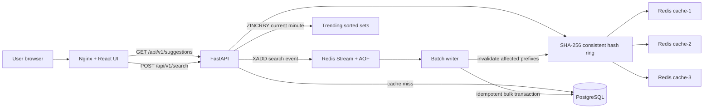

# Suggest: Distributed Search Typeahead System

**Course:** HLD101 Search Typeahead Assignment  
**Repository:** <https://github.com/ReaperXD67/distributed-search-typeahead>  
**Prepared by:** Aman Kumar  
**Report date:** 22 June 2026

## Executive Summary

Suggest is a full-stack search typeahead application built over a reproducible dataset of 100,000 unique queries. While a user types, the application returns up to ten matching queries ordered by popularity. Search submissions immediately update a recency-weighted trending view and are stored in a durable Redis Stream. A background worker aggregates repeated submissions before updating PostgreSQL, reducing database write pressure. Suggestion results are cached across three independent Redis nodes using application-level consistent hashing with virtual nodes and clockwise failover.

The production-style local environment contains six Docker containers: frontend, backend, PostgreSQL, and three Redis nodes. The project includes a responsive React interface, FastAPI/OpenAPI documentation, health and metrics endpoints, automated unit tests, a complete-stack smoke test, GitHub Actions CI, performance measurements, and failure-testing evidence.

## 1. Architecture Diagram and Explanation



### 1.1 Suggestion read path

1. The React interface waits 160 milliseconds after the latest keystroke.
2. It cancels any older request and calls `GET /api/v1/suggestions`.
3. The API normalizes the prefix by trimming, case-folding, and collapsing whitespace.
4. The consistent-hash ring maps `suggestions:<prefix>` to one Redis node.
5. On a cache hit, the API returns the serialized top-ten list.
6. On a cache miss, PostgreSQL performs an indexed anchored-prefix query, ordered by count descending.
7. The result is cached with a configurable TTL and returned to the browser.

PostgreSQL remains the source of truth; Redis contains disposable derived results. If a cache node fails, the API tries the next unique physical node clockwise. Redis operations have a 150 ms timeout, and failed nodes enter a five-second local failure circuit.

### 1.2 Search submission and batch-write path

1. The browser sends `POST /api/v1/search`.
2. The API appends a UUID-tagged event to a Redis Stream persisted with AOF.
3. In parallel, it increments the current one-minute trending sorted set.
4. It returns HTTP 202 with `status: searched` and `queued: true`.
5. The worker reads or reclaims up to 250 Stream messages.
6. PostgreSQL bulk-inserts event IDs using `ON CONFLICT DO NOTHING`.
7. Only newly inserted events are aggregated by query.
8. One bulk upsert increments all affected query counts.
9. The transaction commits before messages are acknowledged.
10. Cached prefixes belonging to changed queries are invalidated.

This provides an exactly-once count effect on top of at-least-once delivery. If the worker crashes after committing but before acknowledgement, the event is delivered again, but its UUID prevents a second increment.

### 1.3 Trending searches

Searches are stored in per-minute Redis sorted sets. Reading a window pipelines the relevant buckets and applies exponential recency decay:

```text
score = sum(bucket_count * 0.5 ^ (bucket_age / (window_minutes / 4)))
```

Recent activity therefore ranks above equally sized older activity. Old buckets expire automatically. Before enough live searches exist, globally popular queries fill unused UI positions.

### 1.4 Consistent hashing

The application uses SHA-256 and 128 virtual nodes for each of three physical Redis nodes. A key belongs to the first ring position found clockwise. Virtual nodes improve balance, while consistent hashing ensures that adding a fourth node moves approximately one quarter of keys instead of remapping almost everything.

Redis Cluster was intentionally not used because the assignment requires the application to demonstrate cache distribution through consistent hashing.

## 2. Dataset Source and Loading Instructions

### 2.1 Dataset source

The committed dataset is `backend/data/queries.csv`. It contains exactly 100,000 unique rows with this format:

| query | count |
|---|---:|
| iphone | 1000000 |
| iphone 15 | 850000 |
| iphone charger | 600000 |
| java tutorial | 400000 |

The dataset is generated deterministically by `backend/scripts/generate_dataset.py`. It combines curated demonstration queries with generic commerce, technology, education, travel, media, and lifestyle vocabulary. Counts follow a seeded Zipf-like long-tail distribution, which approximates the relationship between a small set of very popular searches and many less-popular searches.

The generator and output are both committed, making the dataset reproducible, offline, free from personal data, and independent of external downloads or credentials.

### 2.2 Regenerating the dataset

From the repository root:

```powershell
python backend/scripts/generate_dataset.py
```

Expected output:

```text
Generated 100,000 unique queries at .../backend/data/queries.csv
```

### 2.3 Loading the dataset

The normal loading process is automatic:

```powershell
docker compose up --build -d
```

When the backend starts, it:

1. Waits for PostgreSQL health.
2. Creates the database tables and indexes.
3. Checks whether `search_queries` is empty.
4. Parses the CSV in a worker thread.
5. Uses PostgreSQL binary copy through `asyncpg.copy_records_to_table`.
6. Skips seeding on future restarts when data already exists.

Verify the loaded row count:

```powershell
docker compose exec -T postgres psql -U typeahead -d typeahead -c "SELECT COUNT(*) FROM search_queries;"
```

Expected result: `100000`.

To perform a completely clean reload:

```powershell
docker compose down -v
docker compose up --build -d
```

The `-v` option removes PostgreSQL and Redis volumes, so it should be used only when a clean reset is intended.

## 3. API Documentation

Interactive OpenAPI documentation is available after startup at:

```text
http://localhost:8000/docs
```

### 3.1 Suggestions

```http
GET /api/v1/suggestions?q=iph&limit=10
```

Constraints:

- `q`: required, 1-200 characters.
- `limit`: optional, 1-10, default 10.

Example response:

```json
{
  "query": "iph",
  "suggestions": [
    {"query": "iphone", "count": 1000000},
    {"query": "iphone 15", "count": 850000}
  ],
  "cached": true,
  "cache_node": "cache-1",
  "duration_ms": 1.57
}
```

### 3.2 Search submission

```http
POST /api/v1/search
Content-Type: application/json

{"query":"iphone charger"}
```

Returns HTTP 202:

```json
{
  "status": "searched",
  "query": "iphone charger",
  "event_id": "4b422dd7-...",
  "queued": true,
  "message": "Searched for \"iphone charger\". Popularity update queued."
}
```

### 3.3 Trending searches

```http
GET /api/v1/trending?limit=10&window_minutes=60
```

Returns the ranked query, recency-weighted score, rank, selected window, generation timestamp, and whether results came from the live window or popular fallback.

### 3.4 Metrics

```http
GET /api/v1/metrics
```

Reports:

- Suggestion requests and search submissions.
- Cache hits, misses, failovers, and hit rate.
- PostgreSQL read/write statement counts.
- p50 and p95 suggestion latency.
- Batch count, most recent batch size, flush duration, and write-reduction percentage.
- Health of each physical Redis cache node.

### 3.5 Cache distribution

```http
GET /api/v1/system/cache-distribution
```

Explains the hashing algorithm, virtual-node count, physical nodes, prefix-to-node mappings, and sample distribution.

### 3.6 Manual flush

```http
POST /api/v1/system/flush
```

Forces one batch flush for demonstrations and integration tests.

### 3.7 Health

```http
GET /health
```

Checks PostgreSQL and all Redis nodes. It returns `healthy` when every dependency responds and `degraded` when cache failover is active.

## 4. Design Choices and Tradeoffs

| Decision | Reason | Tradeoff |
|---|---|---|
| Cache-aside suggestions | Keeps PostgreSQL authoritative and cache optional | Requires cold-miss handling and invalidation |
| Application-level consistent hashing | Directly demonstrates assignment requirement | Membership must be consistent across API replicas |
| 128 virtual nodes per Redis | Balanced distribution with small ring memory | More ring entries than one point per node |
| Redis Stream with AOF | Durable buffering, consumer groups, pending recovery | More operational complexity than an in-memory queue |
| UUID idempotency table | Makes redelivery safe | Idempotency records require retention management |
| Asynchronous count updates | Reduces request latency and database writes | Counts are eventually consistent for a few seconds |
| Minute trend buckets | Windowed scoring and automatic TTL cleanup | Less precise than per-second event analytics |
| Targeted prefix invalidation plus TTL | Fast freshness with eventual safety | A query of length L can require L deletes |
| PostgreSQL text-pattern index | Simple indexed prefix search at current scale | Precomputed prefix top-K is better at extreme scale |
| Local React state | Direct and sufficient for one focused screen | A larger multi-page application would need stronger server-state tooling |
| Nginx same-origin proxy | Simple deployment, gzip, and no production CORS issue | Adds one container and proxy configuration |
| No end-user authentication | Search is public and no personal data is stored | Operational endpoints must be protected before public deployment |

### Failure tradeoffs

- **Crash before flush:** Stream retains the event.
- **Crash during PostgreSQL transaction:** the complete transaction rolls back.
- **Crash after commit but before acknowledgement:** the event is retried but UUID idempotency prevents duplication.
- **One Redis node unavailable:** the next clockwise node serves the request; health reports degraded.
- **All Redis nodes unavailable:** PostgreSQL can still provide suggestions, although cache population is skipped and latency increases.

### Alternatives considered

- PostgreSQL-only design: simpler but produces avoidable repeated reads.
- Modulo hashing: easy but remaps most keys after membership changes.
- Redis Cluster: operationally useful but hides application-level hashing.
- In-memory queue: small but loses unflushed searches on crash.
- Kafka: excellent at very high scale but excessive for a local assignment.
- Elasticsearch/OpenSearch: useful for fuzzy matching and analyzers but unnecessary for exact prefix ranking over 100,000 rows.

## 5. Performance Report

Measurements were taken on 22 June 2026 using the production Docker Compose stack on Docker Desktop for Windows.

### 5.1 Suggestion performance

| Measurement | Requests | Concurrency | Result |
|---|---:|---:|---:|
| Server-side p50 | 5,001 | Up to 50 | **2.27 ms** |
| Server-side p95 | 5,001 | Up to 50 | **18.86 ms** |
| Cache hit rate | 5,001 | Up to 50 | **98.1%** |
| Request failures | 5,001 | Up to 50 | **0** |
| Docker-network client p95 | 2,000 | 50 | 171.77 ms |
| Windows host client p95 | 1,000 | 10 | 123.42 ms |

Server-side latency isolates FastAPI processing. Client figures also include Python client scheduling and Docker Desktop/WSL networking, so both are reported separately.

Run the benchmark:

```powershell
python backend/scripts/benchmark.py --base-url http://localhost:8000 --requests 2000 --concurrency 50
```

### 5.2 Batch-write reduction

A burst submitted 500 identical searches for `distributed systems course`:

| Signal | Result |
|---|---:|
| Accepted submissions | 500/500 |
| Persisted count increase | 500 |
| Events in measured window | 501 |
| Batch flushes | 4 |
| PostgreSQL write statements | 8 |
| Naive one-write-per-event baseline | 501 |
| Write reduction | **98.4%** |

Every flush uses one bulk idempotency insert and one bulk aggregated query upsert. Repeated queries therefore collapse especially well.

### 5.3 Cache-node failure drill

`premium` was mapped to `cache-2`, after which Redis B was stopped. The API returned all ten suggestions through `cache-1` in 178 ms, recorded read/write failovers, and reported degraded health. Redis B was restarted and returned to healthy status.

### 5.4 Verification summary

- 100,000 database rows after clean startup.
- 8 backend tests passed.
- 2 frontend tests passed.
- Ruff lint passed.
- Strict TypeScript and Vite production build passed.
- Production smoke test passed.
- Desktop and 390 px mobile browser layouts verified.
- Keyboard navigation, Enter submission, loading, empty, error, and queued states verified.
- All six Docker containers healthy.
- GitHub Actions backend, frontend, and full-container jobs passed.

## Running the Complete Project

```powershell
cd "C:\Users\Aman\OneDrive\Desktop\Scaler\Suggestion_feature"
docker compose up --build -d
docker compose ps
Start-Process "http://localhost:3000"
```

Stop while preserving data:

```powershell
docker compose down
```

## Conclusion

The system satisfies the complete assignment while remaining easy to run and explain. The read path uses distributed cache-aside access for low latency. The write path uses durable, idempotent batching to reduce PostgreSQL pressure. Trending searches remain immediately visible, failures are observable, and all important behavior is supported by tests and measurements. The architecture can scale horizontally and has clear next steps - precomputed prefix top-K data, managed replicated storage, centralized metrics, service discovery, and regional caches - for substantially larger production traffic.

