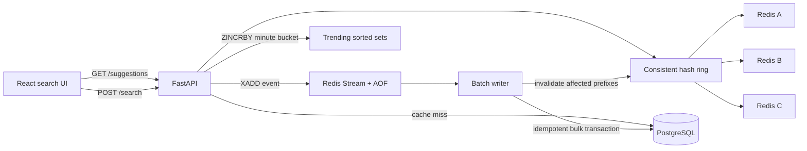

# Suggest — Distributed Search Typeahead

A complete search typeahead system that returns the ten most popular prefix matches, records searches asynchronously, computes live trending queries, and distributes cached suggestions across independent Redis nodes with consistent hashing.

## Project demo video

[Watch the complete working demonstration](https://drive.google.com/file/d/1MpjkRs8duS4mZLpqcqrK3bg0dXgdk5ct/view?usp=sharing)

The video demonstrates the running Docker containers, local application, typeahead suggestions, search submissions, trending searches, system metrics, and overall project flow.


## What is included

- 100,000 unique, deterministic search queries with realistic Zipf-like counts
- Ranked prefix suggestions with a maximum of ten results
- Dummy search submission API returning `searched` and immediately updating live trends
- Durable Redis Stream event queue and periodic/size-triggered batch writer
- Exactly-once popularity increments through idempotent event IDs
- Three independent Redis cache nodes behind a SHA-256 consistent-hash ring
- 128 virtual nodes per cache for balanced distribution and minimal key movement
- Clockwise cache failover with a five-second failure circuit
- Recency-weighted, minute-bucket trending searches
- p50/p95 latency, cache hit rate, database reads/writes, failovers, and write-reduction metrics
- Accessible combobox, loading/error/empty states, keyboard navigation, responsive layout
- Docker Compose, health checks, API docs, unit tests, CI, benchmark tooling, and screenshots

## Architecture



The cache is intentionally **not** Redis Cluster. The assignment asks the application to demonstrate consistent hashing, so each Redis instance is independent and the application owns key placement. A prefix key such as `suggestions:iph` hashes onto one point in a ring containing 128 virtual positions per physical cache.

## Run locally

Prerequisites: Docker Desktop with Compose.

```bash
git clone <repository-url>
cd Suggestion_feature
docker compose up --build -d
```

Open:

- Application: <http://localhost:3000>
- OpenAPI/Swagger: <http://localhost:8000/docs>
- Health: <http://localhost:8000/health>
- Metrics: <http://localhost:8000/api/v1/metrics>

The first clean startup creates the schema and uses PostgreSQL binary copy to ingest all 100,000 rows. Volumes preserve PostgreSQL and Redis AOF data between restarts.

Useful commands:

```bash
docker compose ps
docker compose logs -f backend
make smoke
docker compose down
docker compose down -v   # also removes local data volumes
```

## Dataset

The committed dataset is [`backend/data/queries.csv`](backend/data/queries.csv) with columns `query,count` and exactly 100,000 unique rows. It is generated from generic commerce, learning, travel, media, and technology vocabulary, plus curated demonstration queries. Counts follow a seeded Zipf-like curve to approximate the long-tail distribution found in search logs.

Regenerate it deterministically:

```bash
python backend/scripts/generate_dataset.py
```

The generator seed, target size, featured queries, and vocabulary are versioned in [`backend/scripts/generate_dataset.py`](backend/scripts/generate_dataset.py), so the data is reproducible and carries no personal information or restrictive external license.

## API

| Method | Route | Purpose |
|---|---|---|
| `GET` | `/api/v1/suggestions?q=iph&limit=10` | Popular prefix suggestions, cached through the ring |
| `POST` | `/api/v1/search` | Return `searched`, enqueue count update, record live trend |
| `GET` | `/api/v1/trending?limit=10&window_minutes=60` | Recency-weighted trending queries |
| `GET` | `/api/v1/metrics` | Latency, cache, database, failover, and batch metrics |
| `GET` | `/api/v1/system/cache-distribution` | Explain ring mappings and node distribution |
| `POST` | `/api/v1/system/flush` | Force a batch flush for demonstration/testing |
| `GET` | `/health` | PostgreSQL and all Redis node health |

Example:

```bash
curl "http://localhost:8000/api/v1/suggestions?q=iph"
curl -X POST "http://localhost:8000/api/v1/search" \
  -H "Content-Type: application/json" \
  -d '{"query":"iphone charger"}'
```

## Batch-write safety

Search submission appends an event to a Redis Stream and returns HTTP 202. Redis AOF persists the buffer. The worker claims up to 250 messages, inserts all event IDs with `ON CONFLICT DO NOTHING`, aggregates only newly inserted IDs, then bulk-upserts query counts in the same PostgreSQL transaction. It acknowledges stream entries only after commit.

- Crash before flush: events remain in the stream.
- Crash during the transaction: PostgreSQL rolls back the entire batch.
- Crash after commit but before acknowledgement: the event is redelivered, but its unique event ID prevents a second increment.
- Abandoned consumer: `XAUTOCLAIM` transfers idle pending entries to the new worker.

## Tests and quality checks

```bash
cd backend
uv sync --extra dev
uv run pytest -q
uv run ruff check app tests scripts

cd ../frontend
npm ci
npm test -- --run
npm run build
```

Run the production benchmark while the stack is up:

```bash
python backend/scripts/benchmark.py --base-url http://localhost:8000 --requests 2000 --concurrency 50
```

See [`PERFORMANCE_REPORT.md`](PERFORMANCE_REPORT.md) for measured results, cache-node failure behavior, and batching evidence.

## Project structure

```text
.
├── backend/
│   ├── app/
│   │   ├── routers/          # Search and system HTTP endpoints
│   │   ├── services/         # Ring, cache, trends, batching, repository, metrics
│   │   ├── config.py         # Environment-backed settings
│   │   ├── db.py             # Async PostgreSQL and fast dataset ingestion
│   │   ├── main.py           # Lifespan, middleware, app assembly
│   │   ├── models.py         # SQLAlchemy tables and indexes
│   │   └── schemas.py        # Validated API contracts
│   ├── data/queries.csv      # 100,000-row reproducible dataset
│   ├── scripts/              # Dataset generator and load benchmark
│   └── tests/                # Backend unit tests
├── frontend/
│   ├── src/                  # React UI, API client, types, tests, design system CSS
│   ├── nginx.conf            # Static hosting and reverse proxy
│   └── Dockerfile
├── docs/screenshots/         # Desktop, typeahead, submitted, and mobile evidence
├── docker-compose.yml        # PostgreSQL, 3 Redis nodes, backend, frontend
└── PERFORMANCE_REPORT.md
```

## Screenshots


